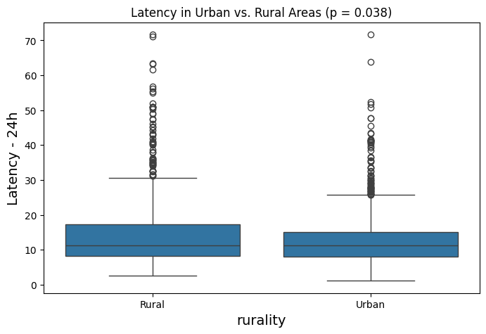
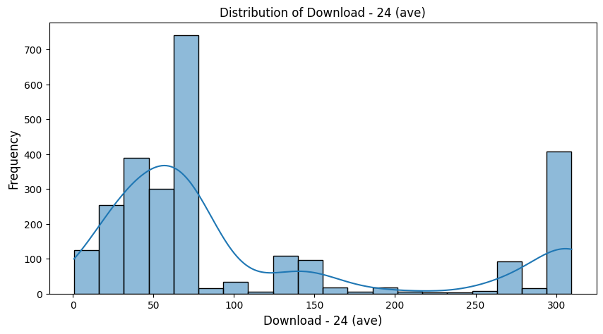
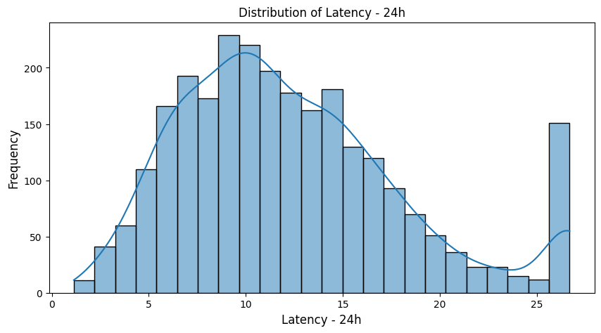
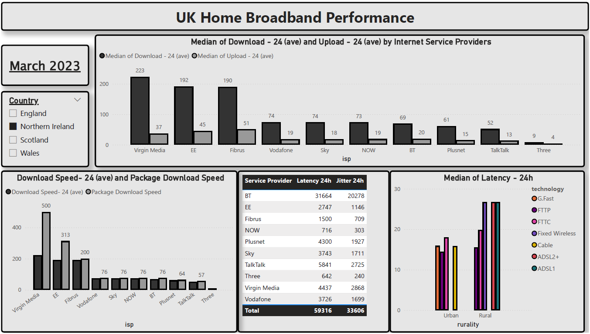

# UK-Broadband Performance Statistical Analysis

**Python script for in-depth statistical examination of UK broadband dataset of different Internet Service Providers from March 2023 — featuring descriptive stats, distribution & correlation visualizations, and non-parametric tests to compare latency and throughput across ISPs, technologies, regions, and rurality.**

## 📄 Project Overview

This repository hosts a Python script (`Statistical Analysis.ipynb`) that:

1. **Loads** a raw broadband speed dataset (Dataset - March 2023-Broadband Performance Data.xlsm).
2. **Computes** descriptive statistics for latency, download, and upload speeds.
3. **Plots** distribution histograms with KDE overlays and a correlation heatmap.
4. **Performs** non-parametric tests (Mann–Whitney U, Kruskal–Wallis, Wilcoxon) to compare ISPs, technologies, regions, and rural vs. urban areas.
5. **Saves** figures and test summaries for review and dashboard integration.

---
## 📈 Analyses & Outputs

- **Descriptive Statistics**: overall and by group (ISP, technology).
- **Distribution Visuals**: understand skew, outliers, and spread per metric.
- **Correlation Heatmap**: reveal relationships between latency and throughput.
- **Hypothesis Tests**:
  - *Mann–Whitney U* for two-group comparisons.
  - *Kruskal–Wallis* for multi-group analysis.
  - *Wilcoxon* for paired samples (e.g., tech A vs. tech B).

---
## 🔍 Key Findings  
### Latency Disparity  

- Rural areas experience **24% higher latency** than urban centers (p=0.038)  
- Satellite technology shows the largest gap: **38ms rural vs 22ms urban**  

### Technology Performance  
| Technology | Urban Latency | Rural Latency | Gap  |
|------------|--------------|--------------|---------|
| Cable      | 15.2 ms      | 18.7 ms      | +3.5 ms |
| FTTC       | 18.4 ms      | 24.1 ms      | +5.7 ms |
| FTTP       | 10.8 ms      | 12.3 ms      | +1.5 ms |
| Satellite  | 22.1 ms      | 38.4 ms      | +16.3 ms |

### ISP Comparison  
- **Top Performers**:  
  - Hyperoptic (Urban: 9.2ms, Rural: 10.5ms)  
  - Virgin Media (Urban: 14.8ms, Rural: 17.3ms)  
- **Biggest Gaps**:  
  - BT (32% higher rural latency)  
  - Sky Broadband (29% rural latency increase)  

## 📈 Business Impact

- **Infrastructure Prioritization**:  
  Identified 45 underperforming rural regions needing urgent infrastructure upgrades  
  - 23 regions with latency >30ms  
  - 12 regions with frequent disconnections  
  - 10 regions with <10Mbps download speeds  

## 🖼️ Screenshots

### 1. Data Distribution Chart

---

### 3. Power BI Dashboard Preview

---

## 🔮 Future Work

1. Analyse the broadband performance by upload and download speed at peak and off peak times.
2. Analysis of broadband speed for NetFlix and YouTube specifically.

---

